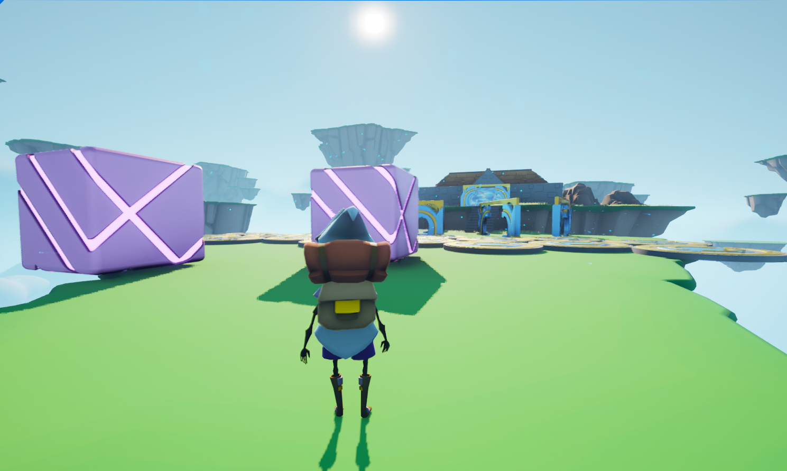

# Descending Dude

[Link to the download page (Itch.io)](https://lycorisbellua.itch.io/unreal-tutos)  

3D obstacle mini-game made with Unreal Engine 5.3.2. Don't fall off!  

C++ project made following [the UE5 "Obstacle Assault" tutorial by Gamedev.tv](https://www.gamedev.tv/courses/unreal-5-0-c-developer-learn-c-and-make-video-games).

